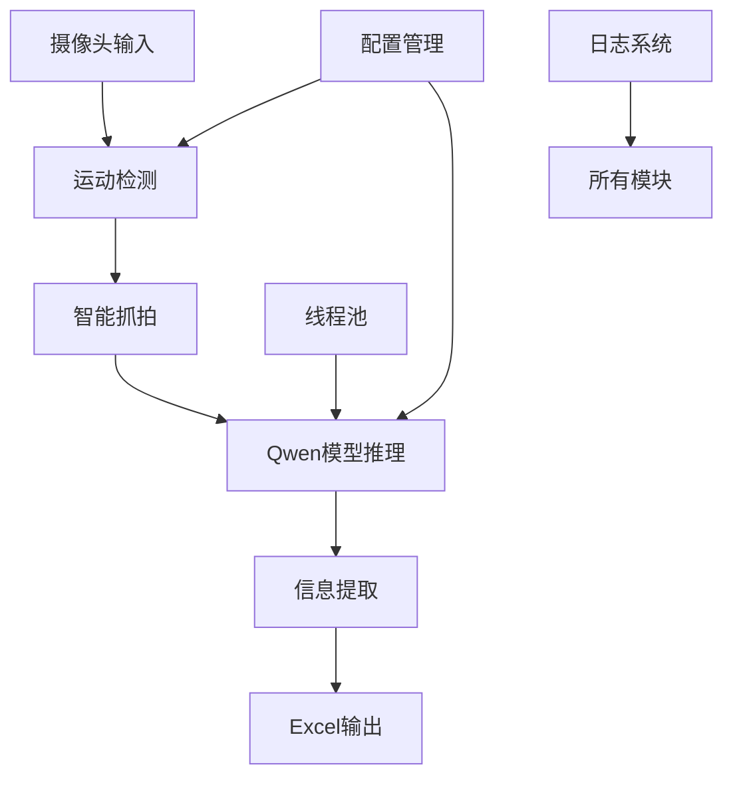

# 财务单据自动抓拍识别工具 v1.0 RC

[](https://python.org)
[](LICENSE)
[](https://www.microsoft.com/windows)
[](https://nvidia.com)

> 🤖 基于计算机视觉和AI大模型的智能财务单据识别系统

## 🌟 项目亮点

- 🎯 **全自动流程**: 检测 → 抓拍 → 识别 → 记录，无需人工干预
- 🔬 **先进AI技术**: 基于Qwen2.5-VL多模态大模型，识别准确率高
- ⚡ **高性能处理**: 多线程并发，支持实时处理
- 🛡️ **生产级稳定**: 异常恢复、优雅退出、日志轮转
- 🔧 **高度可配**: 所有参数可配置，支持不同环境部署
- 📊 **数据管理**: 自动生成Excel报表，便于后续分析

## 项目概述

这是一个基于计算机视觉和AI大模型的财务单据自动识别系统，能够通过高拍仪/俯拍相机自动检测票据出现，进行高清抓拍，并调用Qwen2.5-VL模型提取关键字段信息，最终输出到Excel文件。

## 主要功能

- 🎥 **自动检测**: 通过背景差分算法检测票据出现
- 📸 **智能抓拍**: 检测到稳定状态后自动高清抓拍
- 🤖 **AI识别**: 使用Qwen2.5-VL多模态大模型提取发票信息
- 📊 **自动记录**: 识别结果自动保存到Excel文件
- 🔄 **并发处理**: 支持多线程并发处理，提高效率
- 📝 **日志管理**: 详细的日志记录和轮转管理

## 系统要求

- **操作系统**: Windows 10/11 x64
- **硬件要求**: RTX 4090 (24GB) 或同等级GPU
- **Python版本**: Python 3.10+
- **摄像头**: USB高拍仪或俯拍相机

## 快速开始

### 1. 克隆仓库

```bash
git clone https://github.com/您的用户名/仓库名.git
cd 仓库名
```

### 2. 一键安装和启动

```bash
# Windows用户直接双击
start.bat

# 或手动执行
python test_env.py    # 环境检测
python main_final.py  # 启动主程序
```

### 3. 下载模型

```bash
# 下载Qwen2.5-VL-3B-Instruct模型
git lfs clone https://huggingface.co/Qwen/Qwen2.5-VL-3B-Instruct models/qwen-3b
```

## 安装步骤

### 1. 环境准备

```powershell
# 创建Python虚拟环境
python -m venv venv
.\venv\Scripts\activate

# 升级pip
pip install --upgrade pip
```

### 2. 安装依赖

```powershell
# 安装PyTorch (CUDA 12.1)
pip install torch==2.3.0+cu121 torchvision --extra-index-url https://download.pytorch.org/whl/cu121

# 安装其他依赖
pip install -r requirements.txt
```

### 3. 下载模型

下载Qwen2.5-VL-3B-Instruct模型到 `models/qwen-3b` 目录：

```bash
# 使用git lfs下载（推荐）
git lfs clone https://huggingface.co/Qwen/Qwen2.5-VL-3B-Instruct models/qwen-3b

# 或者从ModelScope下载
# git lfs clone https://modelscope.cn/qwen/Qwen2.5-VL-3B-Instruct.git models/qwen-3b
```

## 配置说明

主要配置文件是 `config.json`，包含以下部分：

### 摄像头配置
```json
"camera": {
  "device_id": 0,              // 摄像头设备ID
  "high_res": [1920, 1080],    // 高清抓拍分辨率
  "detect_res": [640, 480]     // 运动检测分辨率
}
```

### 检测配置
```json
"detection": {
  "motion_threshold": 1500,        // 运动检测阈值
  "stable_frames_trigger": 15,     // 稳定帧数触发抓拍
  "capture_interval_sec": 3.0      // 抓拍间隔时间(秒)
}
```

### 处理配置
```json
"processing": {
  "max_queue_size": 20,        // 任务队列最大长度
  "max_workers": 2             // 线程池工作线程数
}
```

## 使用方法

### 启动程序

```powershell
# 激活虚拟环境
.\venv\Scripts\activate

# 运行主程序
python main_final.py
```

### 操作步骤

1. **启动程序**: 运行后会自动打开摄像头预览窗口
2. **放置票据**: 将发票或票据放在摄像头视野内
3. **自动识别**: 系统检测到稳定状态后自动抓拍并识别
4. **查看结果**: 识别结果保存在 `results.xlsx` 文件中
5. **退出程序**: 按ESC键或Ctrl+C退出

### 输出文件

- **抓拍图片**: 保存在 `shots/` 目录
- **识别结果**: 保存在 `results.xlsx` 文件
- **日志文件**: 保存在 `app.log` 文件

## 文件结构

```
InvBot/
├── app/                     # 核心模块
│   ├── config.py           # 配置管理
│   ├── camera.py           # 摄像头监控
│   └── extractor.py        # 信息提取
├── models/                 # 模型目录
│   └── qwen-3b/           # Qwen2.5-VL模型
├── shots/                  # 抓拍图片
├── config.json            # 主配置文件
├── main_final.py          # 主程序入口
├── requirements.txt       # 依赖清单
├── results.xlsx           # 输出结果
└── README.md              # 说明文档
```

## 常见问题

### 1. 摄像头无法打开
- 检查摄像头是否正确连接
- 修改 `config.json` 中的 `device_id`
- 确保没有其他程序占用摄像头

### 2. 模型加载失败
- 确认模型文件完整下载到 `models/qwen-3b` 目录
- 检查显存是否足够（需要约10GB显存）
- 尝试减少 `max_workers` 数量

### 3. Excel写入权限错误
- 关闭Excel文件（如果已打开）
- 检查文件写入权限
- 可以考虑使用 `xlsxwriter` 引擎

### 4. 误触发抓拍
- 调高 `motion_threshold` 值
- 增加 `stable_frames_trigger` 数量
- 在票据下方铺白纸减少光影变化

## 参数调优

### 光照环境差异大
```json
"motion_threshold": 2000  // 提高阈值
```

### 处理速度慢
```json
"max_workers": 1  // 减少并发数
```

### 抓拍太频繁
```json
"capture_interval_sec": 5.0  // 增加间隔时间
```

## 打包部署

使用PyInstaller打包成exe文件：

```powershell
pyinstaller main_final.py --onefile ^
  --add-data "models/qwen-3b;models/qwen-3b" ^
  --add-data "config.json;."
```

## 技术架构



## 贡献指南

1. Fork 项目
2. 创建功能分支 (`git checkout -b feature/AmazingFeature`)
3. 提交更改 (`git commit -m 'Add some AmazingFeature'`)
4. 推送到分支 (`git push origin feature/AmazingFeature`)
5. 打开 Pull Request

## 开发计划

- [ ] GUI界面开发
- [ ] 支持更多票据类型
- [ ] 模型微调工具
- [ ] 批量处理功能
- [ ] 云端部署支持
- [ ] Docker容器化
- [ ] API接口开发

## 许可证

本项目采用 MIT 许可证 - 查看 [LICENSE](LICENSE) 文件了解详情

## 技术支持

如有问题请提交Issue或联系开发团队。

## 致谢

- [Qwen团队](https://github.com/QwenLM/Qwen2.5-VL) - 提供强大的多模态大模型
- [OpenCV社区](https://opencv.org/) - 计算机视觉基础库
- [Transformers](https://huggingface.co/transformers/) - 深度学习模型框架

---

**AI4FIN Team** - 财务单据自动识别工具 v1.0 RC

⭐ 如果这个项目对您有帮助，请给我们一个Star！ 